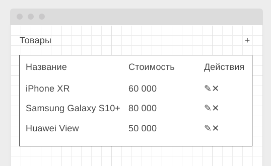

https://ajoq.github.io/list-of-products/

---

#### Описание

Реализовать базовые операции CRUD на примере списка товаров:

При нажатии на кнопку редактирования или добавления должно открываться всплывающее окно:

Если вы нажимаете на кнопку "+" (добавить), то окно пустое, если вы нажимаете "✎" (редактировать), то поля заполнены.

После нажатия на кнопке "Сохранить" данные в таблице должны обновляться.

Обеспечьте валидацию данных: удостоверьтесь, что в полях название и стоимость есть текст, причём в поле стоимость допустимы только числа больше 0. Если ошибки присутствуют, отображайте их под полями ввода в виде текста.

При нажатии на кнопке "✕", строка должна удаляться.